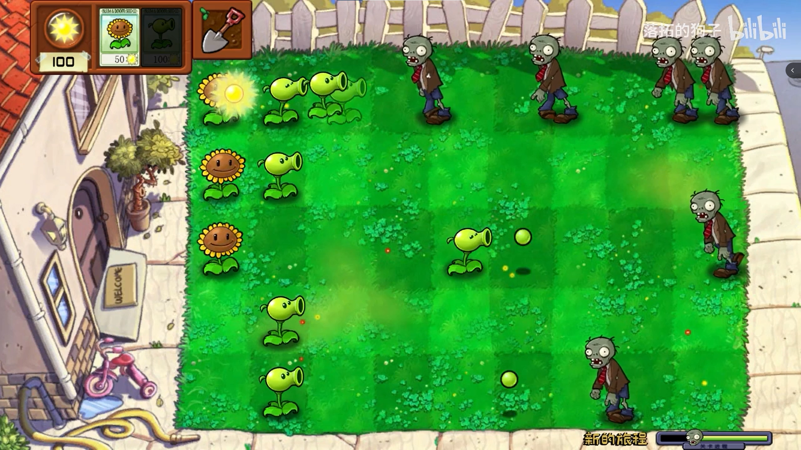
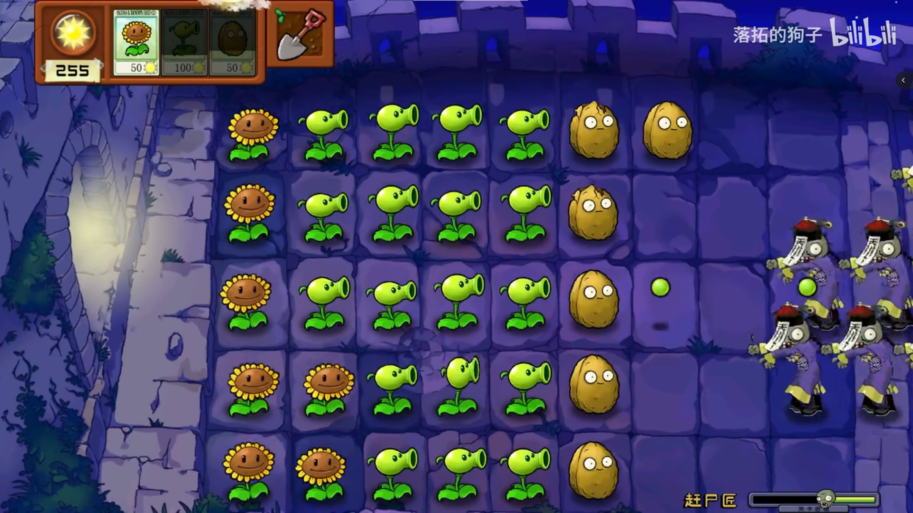
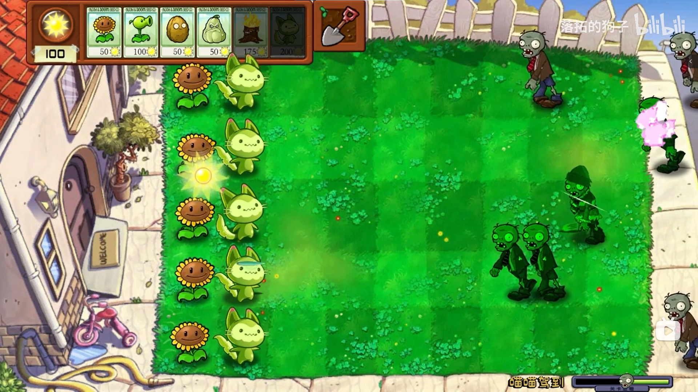

# PvZ-Unity
基于Unity对植物大战僵尸（PvZ）进行的复刻，高还原度。仅实现了完整的关卡流程，未复刻原版PVZ的完整游戏流程。自定义了一些新植物、新僵尸、新关卡，部分所用素材来源于网络。

## 项目展示

### 项目视频

项目展示视频已上传至B站，欢迎到UP“落拓的狗子”主页查看，部分视频链接如下：

【戴夫：没想到吧，小推车被我偷走了［自制PVZ］】 https://www.bilibili.com/video/BV1U84y1b7i4/?share_source=copy_web&vd_source=c0fb8fd2ce069eb3b7f57c407f2e3a26

【新关卡：不亡之地 | 四处飘荡的幽灵、会复活的僵尸】 https://www.bilibili.com/video/BV1C14y1F77b/?share_source=copy_web&vd_source=c0fb8fd2ce069eb3b7f57c407f2e3a26

【新植物：喵喵 | 一秒落泪？你的童年DNA动了吗】 https://www.bilibili.com/video/BV13k4y1e7bL/?share_source=copy_web&vd_source=c0fb8fd2ce069eb3b7f57c407f2e3a26

### 项目截图

## 快速上手

- 下载源代码，使用 Unity 将文件夹作为项目打开。
    - Unity版本：2021.3.8f1c1
- 加载游戏场景 Assets/Scenes/GameScene 。
- 启动项目。

## 项目注释

- 游戏场景中对象 Game Management 具有同名脚本组件，其参数 level 用于设置所加载关卡，目前可使用值为 0 - 4 。
